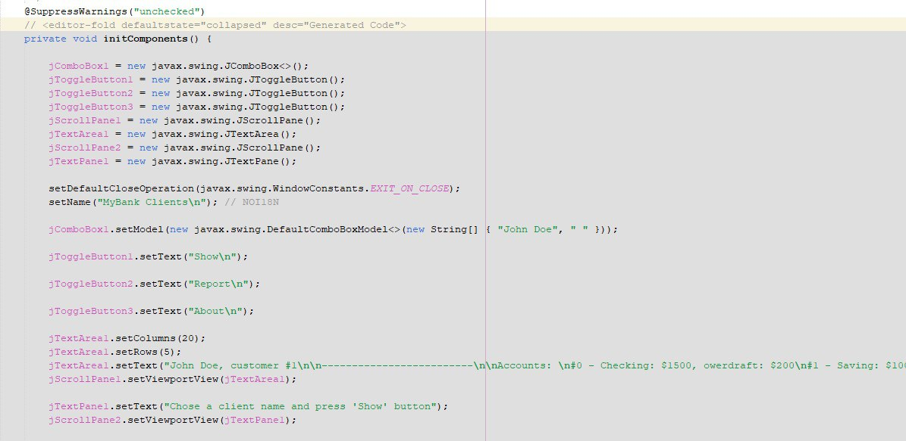

# Lab 4
# Створення GUI з допомогою Matisse 

Мета роботи - навчитись створювати прості графічні інтерфейси з допомогою Netbeans Swing GUI Builder( [Matisse](https://netbeans.org/features/java/swing.html)). 

Допоміжні матеріали: 
- [Скрінкасти](https://netbeans.org/kb/docs/java/gui-builder-screencast.htmll) 
- [Навчальні матеріали](https://netbeans.org/kb/docs/java/gui-functionality.html)
- [Репозиторій](https://github.com/liketaurus/OOP-JAVA) з классами з усіх попередніх лаб (завдання 'Banking')

Ви можете обрати завдання на бажану оцінку - три, чотири або п'ять. *УВАГА! Завдання "на чотири" та "на п'ять" потребують виконання завдання "на три"!* 

## На "трійку" 

## На "чотири"
- (не вдалося редагувати код)

## На "п'ять"
-
